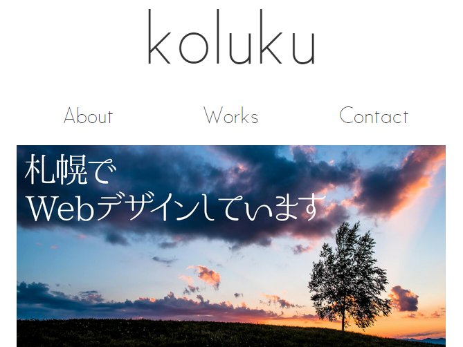

# Stella 

"First step is simple design." シンプルで困ることはないだろう。

## Description

このリポジトリはWordPress向けのデザインテンプレートです。配色は白と黒のみのモノクロ調に仕上げ、シングルカラムで構成されています。

## Install

[こちら](https://github.com/koluku/stella/releases)から最新版のzipファイルをダウンロードして、WordPressを設置しているサーバーにwp-content>themesにフォルダごとアップロードしてください。

## Usage

WordPressの管理画面を開いて外観>テーマからStellaを選択することで利用することができます。

## Demo

以下のリンクよりテストページを体験することができます。

- [Demo](http://koluku.github.io/stella/)

## Contribution

まず初めに[開発方針](https://github.com/koluku/stella/wiki/Develop)をお読みください。その後に[開発方法](https://github.com/koluku/stella/wiki/Release)に従いIssueを建ててからPull requestを送ってください。その際Issueへの紐付けをお願いします。

## Licence

- [MIT LICENSE](LICENSE.md)

## Author

- [koluku](https://github.com/koluku)
